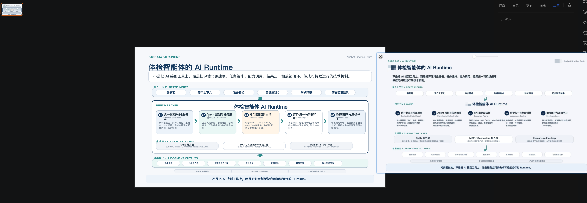
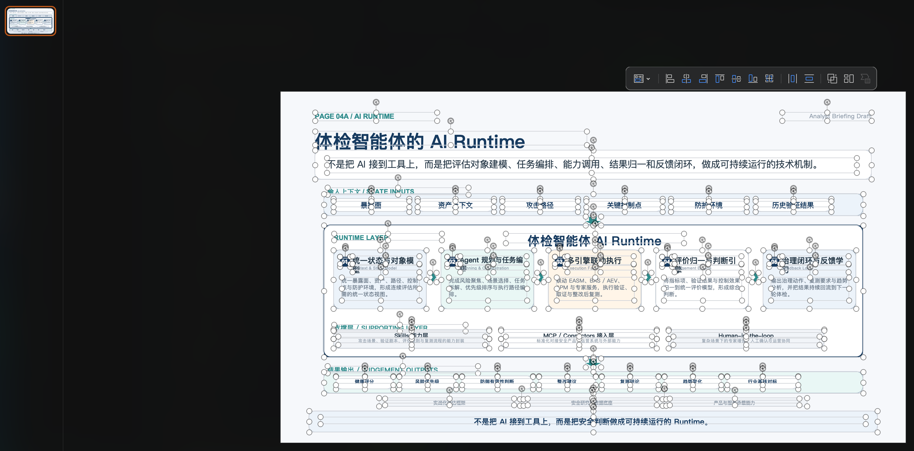

# PPT Workflow Monorepo

这个仓库现在包含两个相关项目：

- `ppt-workflow/`：用于生成 PPT 内容规划，以及导出 HTML 或 PNG 预览
- `html-slide-to-pptx/`：将结构化 HTML slide 转换为可编辑 PPTX 的工具

## 目录结构

```text
.
├── 1.png
├── 2.png
├── ppt-workflow/
└── html-slide-to-pptx/
```

## 推荐使用流程

1. 先使用 `ppt-workflow/` 生成页面内容，并导出 HTML 或 PNG 预览。
2. 先检查预览效果，确认版式、层级和内容表达没有问题。
3. 预览确认后，再使用 `html-slide-to-pptx/` 中的 HTML slide skill，把 HTML 转成可编辑 PPT。
4. 如果 HTML 结构不匹配已有 preset，先为 `html-slide-to-pptx/` 增加对应 preset，再执行转换。

## 流程预览

### 1. 先用 ppt-workflow 产出 HTML 或 PNG 预览



### 2. 再用 html-slide-to-pptx skill 转成可编辑 PPT



## 子项目说明

### ppt-workflow

用于沉淀 PPT 调研结果、页面效果图和相关参考资料，并作为 HTML / PNG 预览生成阶段。

### html-slide-to-pptx

用于把结构化 HTML slide 转换为原生可编辑的 PowerPoint（.pptx）文件。

详细使用说明请分别查看各子目录内的 `README.md`。
