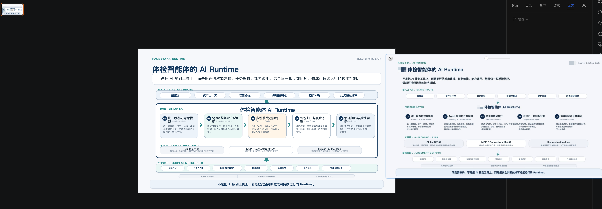
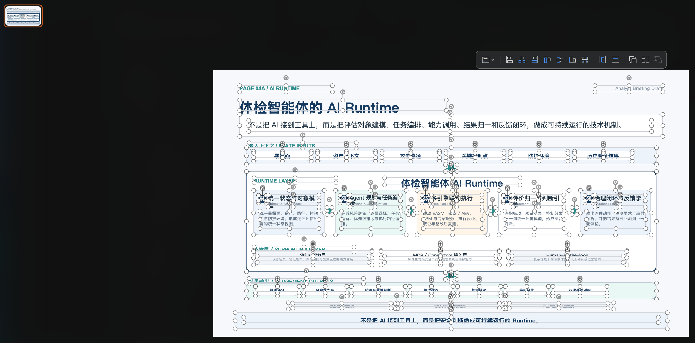

# PPT / bento Workflow Monorepo

这个仓库现在包含三个相关项目：

- `ppt-workflow/`：用于生成 PPT 内容规划，以及导出 HTML 或 PNG 预览
- `html-slide-to-pptx/`：将结构化 HTML slide 转换为可编辑 PPTX 的工具
- `html-to-bento-slides/`：让 agent 将现有 HTML/CSS/JavaScript 演示迁移为可编辑、单文件的 `bento/slides` 文档

## 目录结构

```text
.
├── 1.png
├── 2.png
├── ppt-workflow/
├── html-slide-to-pptx/
└── html-to-bento-slides/
```

## 推荐使用流程

1. 先使用 `ppt-workflow/` 生成页面内容，并导出 HTML 或 PNG 预览。
2. 先检查预览效果，确认版式、层级和内容表达没有问题。
3. 根据最终交付格式选择转换路径：
   - 需要 PowerPoint 文件：使用 `html-slide-to-pptx/`，生成可编辑 `.pptx`。
   - 需要单文件演示文档：安装并使用 `html-to-bento-slides/`，由 agent 重建为可编辑 `.bento.html`。
4. 如果 HTML 结构不匹配已有 preset，先为 `html-slide-to-pptx/` 增加对应 preset，再执行 PPTX 转换。bento 路径不依赖固定 preset，而是由 agent 分析源文件和实际渲染结果后逐对象迁移。

## 流程预览

### 1. 先用 ppt-workflow 产出 HTML 或 PNG 预览



### 2. 再用 html-slide-to-pptx skill 转成可编辑 PPT



## 子项目说明

### ppt-workflow

用于沉淀 PPT 调研结果、页面效果图和相关参考资料，并作为 HTML / PNG 预览生成阶段。

### html-slide-to-pptx

用于把结构化 HTML slide 转换为原生可编辑的 PowerPoint（.pptx）文件。

### html-to-bento-slides

一个以 agent 工作流为核心的 skill，而不是固定转换脚本。安装后，agent 会同时检查源 HTML/CSS/JavaScript 和浏览器中的实际演示效果，并把内容映射为原生 bento 文字、形状、图片、SVG、表格、图表和媒体元素。

它会：

- 默认忠实保留原演示的内容、顺序、视觉风格和交互语义，而不是擅自重新设计
- 识别分步出现、点击状态、hover、canvas、iframe、字体和本地/远程资源
- 按对象选择原生重建、混合重建或必要的栅格化
- 明确报告近似和无法保留的内容，避免静默丢失
- 使用 bento 的 `validate()`、`measure()` 和逐页视觉检查完成验收

安装到 Codex：

```bash
cp -R html-to-bento-slides ~/.codex/skills/
```

安装到 Claude Code：

```bash
cp -R html-to-bento-slides ~/.claude/skills/
```

安装后可通过 `$html-to-bento-slides` 显式调用；支持自动 skill 发现的 agent 也可以根据任务描述自动加载。

详细说明请查看两个现有项目目录中的 `README.md`，以及 `html-to-bento-slides/SKILL.md`。

## Thanks

<p>
  <a href="https://linux.do">
    
  </a>
</p>

## License

Apache License 2.0.
